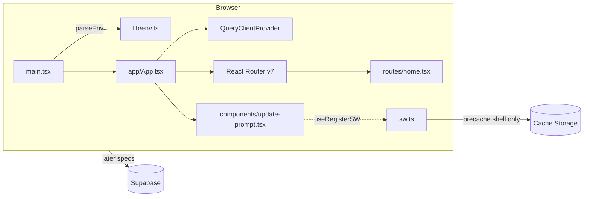

# 001: Project scaffold, design

## Overview

Start from the official Vite `react-ts` template layout, then add the stack from CLAUDE.md in layers: tooling → app shell → PWA → Supabase → tests → CI/Netlify. No product data and no tables yet. The only runtime behaviour is a placeholder home screen, an installable PWA with an offline shell, and an "Update available" prompt.



## Repository layout (files created by this spec)

```
.nvmrc                         22
package.json                   packageManager pnpm@10.x, engines node >=22 <23, scripts (below)
pnpm-lock.yaml
index.html                     viewport-fit=cover, theme-color, apple-touch-icon, manifest link (injected)
vite.config.ts                 react, @tailwindcss/vite, VitePWA, alias @ → src, server.port 5173 strictPort
vitest.config.ts               jsdom, setup file, test env values (dummy Supabase URL/key)
tsconfig.json / tsconfig.app.json / tsconfig.node.json   strict, noUncheckedIndexedAccess, paths @/*
eslint.config.js               flat config: typescript-eslint, react-hooks, react-refresh, jsx-a11y; ignores dist, supabase/functions
.prettierrc.json / .prettierignore   prettier-plugin-tailwindcss
components.json                shadcn/ui config (Tailwind v4, css variables, alias @/components)
pwa-assets.config.ts           @vite-pwa/assets-generator (preset minimal-2023) from public/logo.svg
playwright.config.ts           projects: iphone, pixel; webServer = build + preview on :4173
netlify.toml
.env.example
.github/workflows/ci.yml
scripts/check-bundle-size.mjs  NFR: fails if gzipped JS > 200 KB
public/logo.svg + generated icons (pwa-192x192.png, pwa-512x512.png, maskable-icon-512x512.png, apple-touch-icon-180x180.png, favicon.ico)
src/
  main.tsx                     parseEnv → render <App/> or a full-screen config error
  index.css                    @import "tailwindcss"; @theme tokens (--color-brand: #E11D48) + shadcn CSS variables
  sw.ts                        custom service worker
  app/App.tsx, app/providers.tsx, app/router.tsx, app/manifest.ts
  app/routes/home.tsx, app/routes/not-found.tsx
  components/update-prompt.tsx
  components/ui/button.tsx     shadcn
  features/.gitkeep
  lib/env.ts, lib/supabase.ts, lib/utils.ts (cn), lib/database.types.ts (generated)
  test/setup.ts                @testing-library/jest-dom, virtual module mocks
tests/config/*.test.ts         repo/config tests (toolchain, netlify, CI)
e2e/shell.spec.ts
supabase/config.toml, supabase/seed.sql, supabase/functions/.gitkeep
supabase/migrations/<timestamp>_enable_extensions.sql
supabase/tests/000_smoke.test.sql
```

### package.json scripts

| Script | Command |
| --- | --- |
| `dev` | `vite` |
| `build` | `tsc -b && vite build` |
| `preview` | `vite preview` |
| `lint` | `eslint . && prettier --check .` |
| `format` | `prettier --write .` |
| `typecheck` | `tsc -b --noEmit` (or the equivalent for the referenced projects) |
| `test` | `vitest run` |
| `test:e2e` | `playwright test` |
| `test:db` | `supabase test db` |
| `db:types` | `supabase gen types typescript --local > src/lib/database.types.ts` |
| `size` | `node scripts/check-bundle-size.mjs` |
| `generate-pwa-assets` | `pwa-assets-generator` |

The Supabase CLI is a pinned **devDependency** (`supabase` npm package), so `pnpm exec supabase` works the same locally, in agent sessions and in CI.

### Dependencies

- **Runtime:** react@19, react-dom@19, react-router@7, @tanstack/react-query, zustand, motion, react-hook-form, @hookform/resolvers, zod, date-fns, @date-fns/tz, @supabase/supabase-js, clsx, tailwind-merge, class-variance-authority, @radix-ui/react-slot (shadcn button)
- **Dev:** vite, @vitejs/plugin-react, typescript, tailwindcss@4, @tailwindcss/vite, vite-plugin-pwa, workbox-precaching, workbox-routing, @vite-pwa/assets-generator, eslint + plugins, prettier + prettier-plugin-tailwindcss, vitest, jsdom, @testing-library/react, @testing-library/jest-dom, @testing-library/user-event, @playwright/test, @axe-core/playwright, smol-toml, yaml, supabase

Libraries not used by the shell (zustand, motion, react-hook-form, date-fns) are installed now (R1.1) but not imported, so they cost nothing in the bundle until a feature uses them.

## Data model and migrations

No tables. One migration:

```sql
-- supabase/migrations/<timestamp>_enable_extensions.sql
create extension if not exists pg_cron with schema pg_catalog;
grant usage on schema cron to postgres;
create extension if not exists pg_net with schema extensions;
```

pgTAP smoke test:

```sql
-- supabase/tests/000_smoke.test.sql
begin;
create extension if not exists pgtap with schema extensions;
select plan(2);
select has_extension('pg_cron', 'R2.5: pg_cron is enabled');
select has_extension('pg_net',  'R2.5: pg_net is enabled');
select * from finish();
rollback;
```

`supabase/seed.sql` is empty (just a comment) for now. `src/lib/database.types.ts` is **generated** by `pnpm db:types` against the local stack and committed. It's never hand-written (the guard hook blocks that).

## Security (RLS / Storage / secrets)

No tables or buckets yet, so there are no RLS or Storage policies in this spec.

| Concern | Decision | Covers |
| --- | --- | --- |
| Client env | Only `VITE_SUPABASE_URL`, `VITE_SUPABASE_ANON_KEY` (and later `VITE_VAPID_PUBLIC_KEY`) are read on the client, through `lib/env.ts`. The service-role key is never referenced in `src/`. | R2.2, NFR security |
| Secrets in git | `.env*` ignored except `.env.example`, which holds placeholders only. `VAPID_PRIVATE_KEY` / `VAPID_SUBJECT` are documented as Supabase secrets, not client env. | R1.5 |
| CI secrets | None needed. CI builds with dummy `VITE_*` values (`http://127.0.0.1:54321`, `ci-anon-key`). The shell makes no Supabase calls. | R4.4 |
| Service worker | Precaches only build assets plus an SPA navigation fallback. **No runtime caching routes at all**, so Supabase API and Storage (cross-origin) requests always go to the network. | R3.4 |
| Deploy previews | Netlify env vars (`VITE_*`) are set by the owner in the Netlify UI, never in `netlify.toml`. | R5.3 |

## Frontend

### Env and Supabase client (R2.2, R2.3)

```ts
// src/lib/env.ts
const EnvSchema = z.object({
  VITE_SUPABASE_URL: z.string().url(),
  VITE_SUPABASE_ANON_KEY: z.string().min(1),
});
export type Env = z.infer<typeof EnvSchema>;
export function parseEnv(raw: Record<string, unknown>): Env
// throws EnvError("Missing or invalid environment variable: VITE_SUPABASE_URL. Copy .env.example to .env.local and fill it in.")
// naming every failing variable
```

- `src/lib/supabase.ts` exports one `supabase = createClient<Database>(env.VITE_SUPABASE_URL, env.VITE_SUPABASE_ANON_KEY)`.
- `main.tsx` calls `parseEnv(import.meta.env)` before rendering. On `EnvError` it renders a minimal full-screen message with the error text (no router or providers) and rethrows, so the console shows it too.

### App shell (R3.6)

- `App.tsx` = `<Providers>` (TanStack `QueryClientProvider`, default `staleTime` 30s) + `<RouterProvider>` + `<UpdatePrompt/>`.
- Router (`createBrowserRouter`): `/` → `HomeScreen`, `*` → `NotFound`.
- `HomeScreen`: app name, tagline ("Let your partner pick your outfit"), and a disabled "Coming soon" button (shadcn `Button`). The layout is `min-h-dvh`, padding from `env(safe-area-inset-*)`, and `max-w-md mx-auto` with no fixed widths, so nothing overflows at 375px.
- `index.html`: `<meta name="viewport" content="width=device-width, initial-scale=1, viewport-fit=cover">`, `theme-color` `#E11D48`, `apple-mobile-web-app-capable`, apple-touch-icon.

### PWA (R3.1, R3.2, R3.3, R3.5)

- `src/app/manifest.ts` exports the manifest object, which is imported by `vite.config.ts` and by tests:
  `name: "OhYeah-SuitsYou"`, `short_name: "SuitsYou"`, `display: "standalone"`, `orientation: "portrait"`, `theme_color: "#E11D48"`, `background_color: "#FFFFFF"`, `start_url: "/"`, and icons 192, 512 and a 512 `purpose: "maskable"`.
- `VitePWA({ strategies: 'injectManifest', srcDir: 'src', filename: 'sw.ts', registerType: 'prompt', injectRegister: false, manifest })`.
- `src/sw.ts`:
  ```ts
  precacheAndRoute(self.__WB_MANIFEST);
  cleanupOutdatedCaches();
  registerRoute(new NavigationRoute(createHandlerBoundToURL('index.html')));
  self.addEventListener('message', (e) => { if (e.data?.type === 'SKIP_WAITING') self.skipWaiting(); });
  ```
  No other `registerRoute` calls (R3.4). Later specs add `push` / `notificationclick` handlers here.
- `UpdatePrompt` uses `useRegisterSW()` from `virtual:pwa-register/react`. When `needRefresh` is true it shows a bottom banner (`role="status"`, `aria-live="polite"`, above the safe-area inset) reading "Update available", with a **Reload** button (`updateServiceWorker(true)`) and a **Later** button (dismiss). It doesn't block interaction.

### States to handle

Missing env (config error screen) · unknown route (NotFound) · offline after first visit (cached shell) · new version (UpdatePrompt).

## Quality and CI (R4.*)

- **ESLint** flat config with the recommended rules from typescript-eslint, react-hooks, jsx-a11y and react-refresh. It ignores `dist`, `coverage`, `supabase/functions` (Deno, linted later) and generated `database.types.ts`.
- **Vitest** with `environment: 'jsdom'` and `setupFiles: src/test/setup.ts`. It includes `src/**/*.test.{ts,tsx}` and `tests/**/*.test.ts`, with `test.env` providing dummy `VITE_*` values. `virtual:pwa-register/react` is aliased to a mock in tests.
- **Playwright** projects:
  - `iphone`: `devices['iPhone 14']` with `browserName: 'chromium'` (iPhone viewport, touch, mobile UA)
  - `pixel`: `devices['Pixel 7']`

  `webServer`: `pnpm build && pnpm preview --port 4173 --strictPort` with dummy env. Uses `executablePath` from `PLAYWRIGHT_BROWSERS_PATH` when the bundled browser version doesn't match.
- **GitHub Actions** `.github/workflows/ci.yml`, on `pull_request` and `push` to `main`:
  - job **`checks`**: checkout → pnpm/action-setup → setup-node (`node-version-file: .nvmrc`, pnpm cache) → `pnpm install --frozen-lockfile` → `pnpm lint` → `pnpm typecheck` → `pnpm test` → `pnpm build` → `pnpm size` → `pnpm exec playwright install --with-deps chromium` → `pnpm test:e2e` (uploads the report on failure)
  - job **`db`**: checkout → pnpm install → `pnpm exec supabase db start` (database only, faster than a full start) → `pnpm test:db`
  - No `continue-on-error` anywhere, so any failing step fails the workflow (R4.5).

## Deployment (R5.*)

```toml
# netlify.toml
[build]
  command = "pnpm build"
  publish = "dist"
[build.environment]
  NODE_VERSION = "22"

[[redirects]]
  from = "/*"
  to = "/index.html"
  status = 200

[[headers]]
  for = "/sw.js"
  [headers.values]
    Cache-Control = "no-cache"

[[headers]]
  for = "/manifest.webmanifest"
  [headers.values]
    Cache-Control = "no-cache"
```

The owner's one-time setup (R5.3) is documented in the README: link the repo in Netlify, enable deploy previews, and set the `VITE_SUPABASE_*` env vars.

## Requirement mapping

| Requirement | Design element(s) |
| --- | --- |
| R1.1 | `.nvmrc`, `packageManager`, `engines`, `tsconfig*.json` strict, dependency list |
| R1.2 | `vite.config.ts` `server.port: 5173, strictPort: true`, `dev` script |
| R1.3 | package.json scripts table |
| R1.4 | Repository layout (`.gitkeep` in empty folders) |
| R1.5 | `.env.example`, `.gitignore` |
| R2.1 | `supabase/config.toml`, `migrations/`, `seed.sql`, `functions/` |
| R2.2 | `src/lib/supabase.ts`, `src/lib/env.ts` |
| R2.3 | `parseEnv` + `EnvError`, config error screen in `main.tsx` |
| R2.4 | `test:db` script, `supabase/tests/000_smoke.test.sql` |
| R2.5 | `<timestamp>_enable_extensions.sql` |
| R3.1 | `src/app/manifest.ts`, generated icons |
| R3.2 | `VitePWA` injectManifest config, `src/sw.ts` precache |
| R3.3 | precache + `NavigationRoute` fallback |
| R3.4 | `sw.ts` registers no runtime caching routes |
| R3.5 | `registerType: 'prompt'`, `UpdatePrompt`, `SKIP_WAITING` handler |
| R3.6 | `HomeScreen` layout, viewport meta |
| R4.1 | `eslint.config.js`, `.prettierrc.json`, `lint` script |
| R4.2 | `vitest.config.ts`, `src/test/setup.ts`, home component test |
| R4.3 | `playwright.config.ts`, `e2e/shell.spec.ts` |
| R4.4 | `ci.yml` job `checks` |
| R4.5 | `ci.yml` without `continue-on-error` |
| R4.6 | `ci.yml` job `db` |
| R5.1 | `netlify.toml` build + redirect |
| R5.2 | `netlify.toml` headers |
| R5.3 | Netlify Git integration (owner), README instructions |
| NFR perf | `scripts/check-bundle-size.mjs` in CI |
| NFR a11y | axe check in `e2e/shell.spec.ts` |
| NFR security | Security table above |

## Test plan

| Criterion | Level | Test file |
| --- | --- | --- |
| R1.1 | config | `tests/config/toolchain.test.ts`: `.nvmrc` is 22, `packageManager` is pnpm@10, TS `strict`, required deps present |
| R1.2 | config | `tests/config/toolchain.test.ts`: vite `server.port` 5173 + `strictPort` |
| R1.3 | config | `tests/config/toolchain.test.ts`: all required scripts defined |
| R1.4 | config | `tests/config/toolchain.test.ts`: required folders exist |
| R1.5 | config | `tests/config/toolchain.test.ts`: `.env.example` keys = README env table; `git check-ignore` matches `.env.local` and not `.env.example` |
| R2.1 | config | `tests/config/toolchain.test.ts`: supabase project files exist |
| R2.2 | unit | `src/lib/env.test.ts`: valid env parses; `src/lib/supabase.ts` exports one client |
| R2.3 | unit | `src/lib/env.test.ts`: each missing/invalid variable produces an error naming it |
| R2.4 | db | `supabase/tests/000_smoke.test.sql` (passing proves the runner works) |
| R2.5 | db | `supabase/tests/000_smoke.test.sql`: `has_extension` × 2 |
| R3.1 | unit + e2e | `src/app/manifest.test.ts` (fields, icons, maskable); `e2e/shell.spec.ts`: manifest link served and icons return 200 |
| R3.2 | e2e | `e2e/shell.spec.ts`: a service worker is registered and active |
| R3.3 | e2e | `e2e/shell.spec.ts`: visit → SW ready → `context.setOffline(true)` → reload → home heading visible |
| R3.4 | e2e | `e2e/shell.spec.ts`: after a `fetch` to the Supabase URL, no Cache Storage entry has that origin |
| R3.5 | component | `src/components/update-prompt.test.tsx`: hidden by default; shown when `needRefresh`; Reload calls `updateServiceWorker(true)`; Later hides it |
| R3.6 | component + e2e | `src/app/routes/home.test.tsx` (renders heading and CTA); `e2e/shell.spec.ts`: at 375×667, `scrollWidth <= innerWidth` |
| R4.1 | command | `pnpm lint` in CI |
| R4.2 | component | `src/app/routes/home.test.tsx` |
| R4.3 | e2e | `e2e/shell.spec.ts` runs in both projects |
| R4.4 | config | `tests/config/ci.test.ts`: `checks` job runs lint, typecheck, test, build, test:e2e on `pull_request` |
| R4.5 | config | `tests/config/ci.test.ts`: no step or job has `continue-on-error` |
| R4.6 | config | `tests/config/ci.test.ts`: `db` job runs `supabase db start` + `test:db` on `pull_request` |
| R5.1 | config | `tests/config/netlify.test.ts`: build command, publish dir, SPA redirect |
| R5.2 | config | `tests/config/netlify.test.ts`: `/sw.js` has `Cache-Control: no-cache` |
| R5.3 | manual | Owner checklist in `/spec-verify`: a PR shows a Netlify preview link |
| NFR perf | command | `pnpm size` in CI |
| NFR a11y | e2e | `e2e/shell.spec.ts`: `AxeBuilder` finds 0 violations on `/` |

Config tests (`tests/config/`) are cheap checks that the scaffold's contract doesn't drift. They parse files with `smol-toml` / `yaml` rather than testing tool behaviour.

## Risks and alternatives considered

**Risks**
- **Docker in agent sessions:** `pnpm test:db` and `pnpm db:types` need Docker. Docker is present in the cloud environment but not yet proven to run the Supabase stack there. If it can't, the db task is verified by the CI `db` job, and `database.types.ts` is generated by a human or CI. It's never hand-written.
- **Playwright browser version:** the cloud environment ships a fixed Chromium build. Pin `@playwright/test` to a matching version, or fall back to `executablePath` (per environment notes).
- **iOS fidelity:** the `iphone` project runs Chromium with an iPhone viewport, not real Safari. Install and push behaviour on iOS must still be checked by hand on a device (later specs).

**Alternatives rejected**
- WebKit for the iPhone e2e project: Playwright WebKit's service-worker and offline support is unreliable, which would make R3.3 flaky.
- `generateSW` strategy: can't add custom `push` handlers later. `injectManifest` is required by CLAUDE.md.
- `registerType: 'autoUpdate'`: reloads under the user mid-swipe. A prompt is safer (R3.5).
- Next.js / SSR: the stack review chose a pure SPA.
- Global Supabase CLI install in CI (`supabase/setup-cli`): a pinned devDependency keeps local, agent and CI versions identical.
- `size-limit` package for the NFR: a 30-line script avoids another dependency and config.
- A full `supabase start` in CI: `supabase db start` is enough for pgTAP and much faster.

**Follow-ups (not in this spec)**
- Security headers (CSP, `Referrer-Policy`, `Permissions-Policy`) in `netlify.toml`: worth a small spec once Supabase and Storage origins are known.
- Linting Deno code in `supabase/functions` (spec 008 or wherever the first Edge Function lands).
